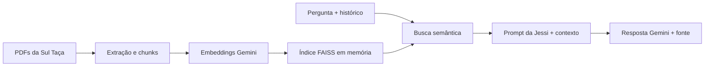

# Sul Taça Agent 🍷

Sul Taça Agent é um projeto educacional desenvolvido para o Challenge Alura Agent. A aplicação simula o atendimento de um e-commerce fictício de vinhos de Porto Alegre e facilita o acesso ao catálogo, às políticas e às informações da loja.

A **Jessi** é a assistente virtual da Sul Taça. Ela ajuda pessoas maiores de 18 anos a escolher uma garrafa, compreender produtos e consultar informações operacionais com linguagem acolhedora, objetiva e fiel às fontes disponíveis.

> A Sul Taça é uma empresa fictícia. Produtos, preços, estoque, políticas e canais de atendimento existem somente para fins educacionais e não representam uma operação comercial real.

## Deploy público

A aplicação está publicada no **Streamlit Community Cloud**:

**[Acessar a Jessi — Sul Taça Agent](https://sul-taca-agent.streamlit.app/)**

## Funcionalidades

- confirmação obrigatória de maioridade antes da liberação do chat;
- identificação por nome opcional;
- menu principal, submenus orientativos e conversa livre;
- recomendação de vinhos por prato, ocasião, presente, preço, preferências e restrições;
- consulta a produtos, entregas, devoluções, reembolsos, privacidade e termos;
- contexto recente da conversa durante a sessão;
- respostas baseadas no catálogo e nos documentos da Sul Taça;
- comparação controlada entre produtos internos e páginas externas diretas;
- fonte consultada disponível em um componente recolhível;
- tratamento amigável para indisponibilidade por cota da API;
- tema com contraste validado segundo o nível AA da WCAG.
- avaliação positiva ou negativa em respostas de conteúdo;
- painel local com métricas de qualidade e uso de recomendações e comparações.

O fluxo atual é:

```text
apresentação → maioridade → nome opcional → menu principal → submenu ou conversa livre
```

## Arquitetura RAG

A aplicação utiliza Geração Aumentada por Recuperação (RAG) para combinar a pergunta e o histórico recente com trechos relevantes da base de conhecimento.



Na inicialização, os PDFs são extraídos e divididos em chunks de 1.000 caracteres, com sobreposição de 300. O modelo `gemini-embedding-001` gera vetores de 768 dimensões, normalizados antes de serem armazenados em um **índice vetorial FAISS em memória**.

A cada pergunta, a aplicação recupera os três chunks semanticamente mais próximos. O prompt da Jessi v1.6 recebe esses candidatos, a pergunta e as últimas seis mensagens da sessão. O modelo `gemini-3.6-flash` gera a resposta e indica somente a fonte que sustenta diretamente a informação utilizada. A preparação dos documentos, embeddings e índice é mantida em cache pelo Streamlit durante a execução.

### Comparação externa controlada

Para comparar um vinho da Sul Taça com um produto externo, a própria pessoa
fornece a URL direta da página do produto. A aplicação usa o URL Context de
forma delimitada a essa página; não realiza busca aberta na web nem segue links
para ampliar a consulta. Dados do catálogo e dados externos permanecem
separados, e a interface identifica distintamente as fontes internas e a URL
externa utilizada.

## Tecnologias

- Python 3.13;
- Streamlit;
- Google Gen AI SDK e Gemini;
- FAISS CPU;
- NumPy;
- PyPDF;
- LangChain Text Splitters;
- python-dotenv.

As versões utilizadas estão fixadas em [`requirements.txt`](requirements.txt).

## Como executar localmente

### 1. Criar e ativar um ambiente virtual

```bash
python3 -m venv .venv
source .venv/bin/activate
```

No Windows PowerShell, a ativação pode ser feita com:

```powershell
.venv\Scripts\Activate.ps1
```

### 2. Instalar as dependências

```bash
python3 -m pip install -r requirements.txt
```

### 3. Configurar a chave da Gemini

Crie um arquivo `.env` na raiz do projeto:

```dotenv
GEMINI_API_KEY=sua_chave_ficticia_aqui
```

Substitua o valor fictício pela sua credencial local. O arquivo `.env` está no `.gitignore` e **não deve ser versionado**.

### 4. Iniciar a aplicação

```bash
streamlit run app.py
```

O Streamlit informa no terminal o endereço local da aplicação. Os PDFs da pasta `documentos` precisam permanecer disponíveis para a construção do índice.

### Painel local de qualidade

As respostas elegíveis são registradas anonimamente em SQLite. Pergunta e
resposta só são persistidas, com sanitização de dados pessoais básicos, quando
há uma avaliação. Para abrir o painel em outro processo local:

```bash
streamlit run painel_qualidade.py \
  --theme.base=dark \
  --theme.backgroundColor="#0F0D12" \
  --theme.secondaryBackgroundColor="#211A25" \
  --theme.textColor="#F5F1F6" \
  --theme.primaryColor="#C084D2"
```

O banco fica em `data/qualidade.db` e não é versionado. Esse SQLite pertence à
instância local em que a aplicação está executando: não é um banco compartilhado
e, no deploy do Streamlit Community Cloud, seus dados podem ser perdidos em
reinícios ou recriações da instância. O painel não é publicado porque não possui
autenticação. Um uso de produção exigiria banco persistente compartilhado e
controle de acesso.

As contagens de recomendações e comparações descrevem o uso do atendimento; não
representam compra, conversão, receita ou intenção comercial confirmada. O tema
escuro é aplicado somente ao processo local do painel por parâmetros oficiais
do Streamlit e não altera o tema claro da Jessi. O texto claro e o roxo de
destaque têm contraste WCAG AA sobre os fundos principal e secundário.

## Base de conhecimento

A base contém seis documentos em PDF:

1. [Política de Privacidade](documentos/sultaca_01_politica_de_privacidade.pdf)
2. [Política de Reembolso e Devoluções](documentos/sultaca_02_politica_de_reembolso_e_devolucoes.pdf)
3. [Perguntas Frequentes](documentos/sultaca_03_perguntas_frequentes.pdf)
4. [Guia de Envios e Entregas](documentos/sultaca_04_guia_de_envios_e_entregas.pdf)
5. [Termos e Condições](documentos/sultaca_05_termos_e_condicoes.pdf)
6. [Catálogo de Vinhos](documentos/sultaca_06_catalogo_de_vinhos.pdf)

Os chunks recuperados são tratados como candidatos: proximidade temática não é evidência suficiente. A Jessi utiliza somente informações que sustentam explicitamente a resposta, não transfere regras entre procedimentos e reconhece quando os documentos não permitem confirmar um dado.

## Exemplos

As respostas são geradas em linguagem natural e podem variar. Os exemplos abaixo resumem comportamentos aprovados nos testes.

### Recomendação com restrições

**Pergunta:** “Quero um vinho vegano para risoto de cogumelos e gastar até R$ 100.”

**Resposta resumida:** a Jessi recomenda o **Manhã de Bento Chardonnay 2025**, explica a relação com o prato e informa o preço e o estoque registrados no catálogo.

### Segunda via de nota fiscal

**Pergunta:** “Quero a segunda via da nota fiscal do pedido 13.”

**Resposta resumida:** a Jessi esclarece que não acessa pedidos nem reenvia notas pelo chat e orienta o contato documentado, solicitando apenas número do pedido, nome da pessoa compradora e e-mail usado na compra.

### Parcelamento não documentado

**Pergunta:** “Em quantas vezes posso parcelar minha compra no cartão?”

**Resposta resumida:** a Jessi informa que os documentos mencionam cartão e Pix, mas não especificam a quantidade ou as condições de parcelamento, sem inventar um limite.

## Documentação e testes

- [Persona e diretrizes da Jessi](docs/persona_jessi_sul_taca.md)
- [Prompt do sistema v1.6](prompts/prompt_jessi_sul_taca.md)
- [Testes conversacionais e de interface](docs/testes_conversacionais_jessi.md)
- [Perguntas Frequentes em formato editável](docs/sultaca_03_perguntas_frequentes.md)

Os testes registrados cobrem maioridade, memória da sessão, recomendações com restrições, produtos ausentes, fidelidade factual, exibição de fontes, limites operacionais e acessibilidade da interface.

## Limitações do MVP

- não possui checkout, pagamento ou reserva de estoque;
- não consulta estoque em tempo real;
- não acessa, altera ou acompanha pedidos reais;
- não emite nem reenvia nota fiscal;
- não abre protocolos, trocas, devoluções ou solicitações;
- mantém o contexto somente durante a sessão;
- usa sanitização determinística, que não garante anonimização perfeita de todo texto livre;
- mantém as métricas de qualidade apenas no banco SQLite da execução local;
- pode perder os dados SQLite do deploy quando a instância for reiniciada ou recriada;
- depende da disponibilidade e da cota da API Gemini;
- recupera sempre os três chunks mais próximos, sem limiar calibrado de similaridade.

## Próximos passos

- adotar banco persistente compartilhado e controle de acesso antes de publicar o painel;
- adicionar testes automatizados para o fluxo e as funções do RAG;
- estruturar os tipos e separar melhor interface, estado e recuperação;
- adotar resposta estruturada para separar conteúdo e fonte;
- ampliar o tratamento de erros externos;
- calibrar a recuperação semântica com uma amostra maior de consultas.
